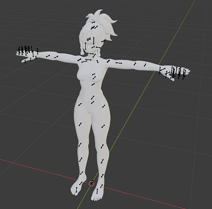
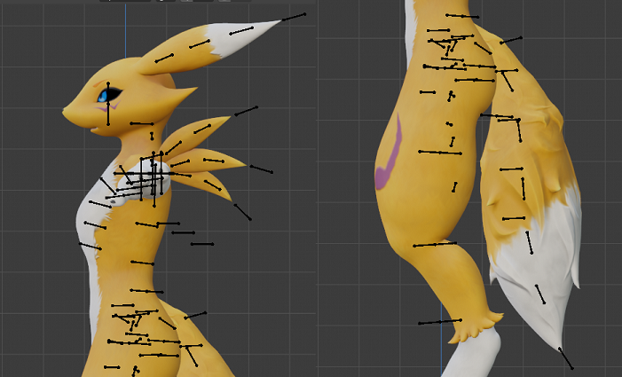
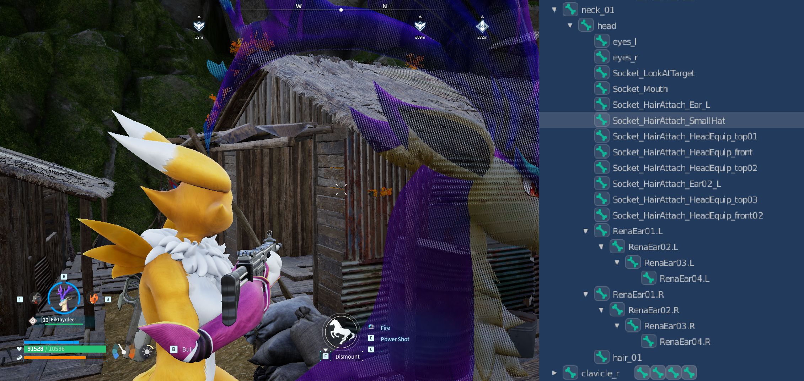
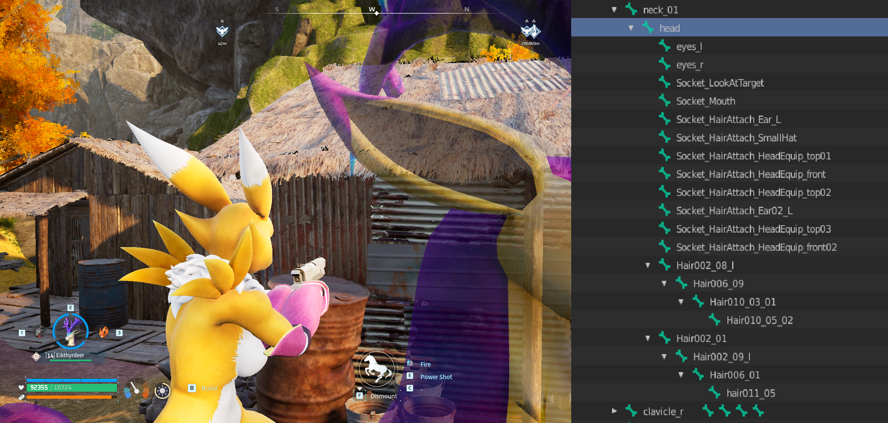

# Kawaii Physics for Player Model Swaps
Using Unreal Editors Compatible Skeletons to add Custom Bones and apply physics to them

- **Written by: `ReapersVigilance`**

#

# Overview

This guide is to show how to setup your model with UE's compatible skeletons to activate Kawaii physics and collision. **FOR CUSTOM ADDED BONES** 
####
I am assuming you understand the concept and setup of model swapping including the extraction from FModel, Importing to Blender, Weight painting, and Export from Blender. I will touch on them briefly however.
Other guides are quite detailed in doing all of the above.

I'm going to Write this as a full Model Swap however it can be done with just Hair/Head Models as long as you use a dummy SK_PalHuman_Skeleton in the proper folder.

process is very similar to a normal model swap except for some key differences in the Exporting from blender and UE work.

## Critical Notes
- This method works for adding physics to **CUSTOM BONES** in both Hair and Head Swaps. It does **NOT** work for adding physics bones to Outfit swaps. (Unless you like T-posing everywhere)So it works best doing them all together and choosing which Kawaii parts will be Hair and which will be Head.
- As long as you're adding physics to Default Bones on an Outfit, that'll work without the Compatible Skeletons. Can skip right to the Kawaii section for that.
####
This is absolutely not a replacement for the bone reorder and animation tool by **`Shifty`**
It just allows you to add physics to swaps without breaking the animations.

Can be used in combination with Jiggle Physics (18+) guide by **`Dytser`**

## Tools Needed

- FModel
- Blender
- UE 5.1
- Kawaii Physics plugin 1.10
- UnrealPak

## Preview
See **`Gif 01`** for a brief preview of what this guide accomplishes
<table>
<tr>
<th>Reference File Name/Description</th>
<th>Reference File</th>
</tr>
<tr>
<td>
  
  **Gif 01 - Preview**  
  
A preview of what will be done using this guide 

The Body/Arms/Legs/Head are an Outfit Swap   
The Ears are a Hair Swap  
The Tail and Spikes are a Head Swap

Note that the objects included in the  
Head and Hair Swaps have Enabled Physics
</td>
<td>
  
   

</td>
</tr>
</table>

#

# Full Process

## Step 1 _ (FModel and Blender) - `File Prep`
- Standard Model Swap process to begin
    - The Psk you will need to Export from FModel is the `SK_Player_Female` from the path `Pal/Content/Pal/Model/Character/Player/Body/Female` this comes with the SK_PalHuman_Skeleton we need
      - can be done with one of the outfit skeletons as well as they reference the same.
- Import this psk into blender along with the model you will be swapping.   **`SEE IMAGE 01`**
- From here is the same as a normal model swap with aligning your model and applying your model to the game skeleton.
<table>
<tr>
<th>Reference File Name/Description</th>
<th>Reference File</th>
</tr>
<tr>
<td>
  
  **Image_01 - Default**  
  
A preview of what will be done using this guide 

The Body/Arms/Legs/Head are an Outfit Swap   
The Ears are a Hair Swap  
The Tail and Spikes are a Head Swap

Note that the objects included in the  
Head and Hair Swaps have Enabled Physics
</td>
<td>
  
   

</td>
</tr>
</table>

## Step 2 _ (Blender) - `Add Bones and Painting`
- You can now add bones to the skeleton that will reference any part you want Kawaii Physics
    - Hair, Tail, Ears, Dangling parts, Whatever
    - Have the last bone of these parts off of the model. It helps for the physics later.  **`SEE IMAGE 02`**
    - ENSURE THESE BONES ATTACH TO OTHER BONES 
        - Example: parent the first bone of a hair chain to the head bone,  
            or parent the first tail bone to the spine_01 bone.
- Weight paint. 
    - Whether you do it manually or use Mesh Data Transfer from the original game model.   
        Tweak as necessary for your new bones.
     - That last bone thats slightly hanging off will need to influence the very tip of whatever part its attached it.
<table>
<tr>
<th>Reference File Name/Description</th>
<th>Reference File</th>
</tr>
<tr>
<td>
  
  **Image_02 - Custom Bones**  
  
An example of Custom added bones  
  
The 4 bone chain for the ears  
linked to the head bone  
  
The 3 bone chains for each spike  
linked to the clavicles  
  
The 7 bone chain for the tail  
linked to the spine
</td>
<td>
  
   

</td>
</tr>
</table>

- There is an in game bug regarding Mounted Combat that needs to be worked around at this point or it will affect everything from here on. **`SEE IMAGE 18`**
    - Any Custom added bones Above the Waist will error when aiming side to side while mounted. This has something to do with the animation lock of the root bone.
    - To Fix. all above waist added bones must use names of existing in game bones that are not being used by the Outfit Swap. 
        - All the Hair bones can be used to fix this **`SEE IMAGE 19`**
    - This bug persists on anything with applied physics even if not using Kawaii. ie. spring controllers for jiggle physics
        - I recommend repurposing the backpack bones as weight paint for breasts
<table>
<tr>
<th>Reference File Name/Description</th>
<th>Reference File</th>
</tr>
<tr>
<td>
  
  **Image_18 - Bug_01**  
  
Shows the Bug of using custom bones while in mounted combat 

Notice the bone tree items marked RenaEar   

Even though im facing left of the mount  
The ears still pull straight back
</td>
<td>
  
   

</td>
</tr>
<tr>
<td>
  
  **Image_19 - Bug_02**  
  
The fix 

Using the exxact same bones  
With identical weight paint  

Only difference if you look at the tree  
the bones are renamed to default hair bones
</td>
<td>
  
   

</td>
</tr>
</table>

